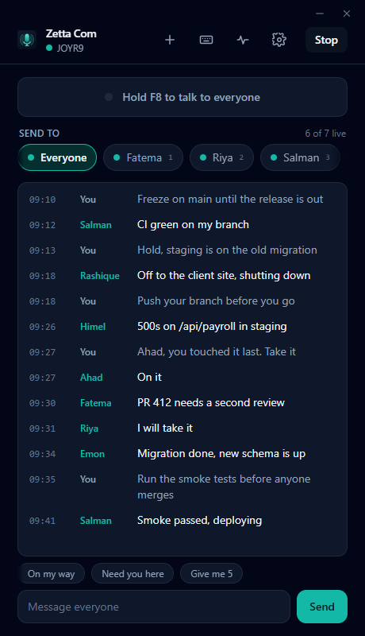
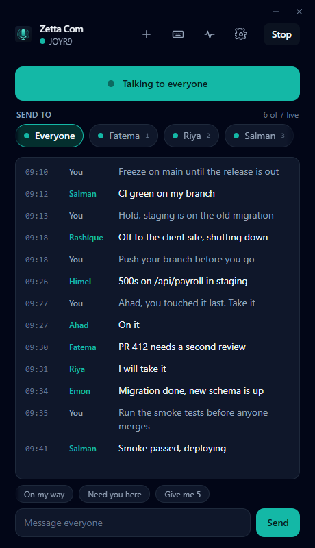
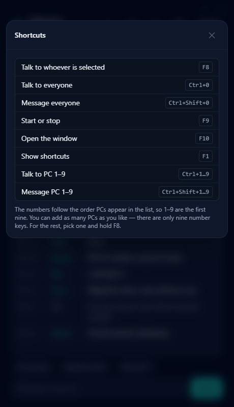
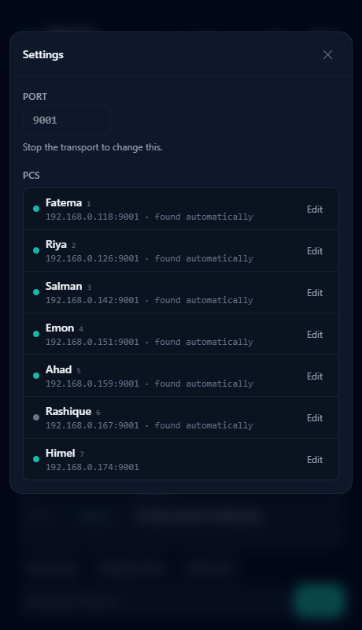
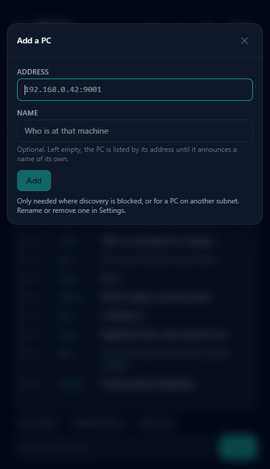
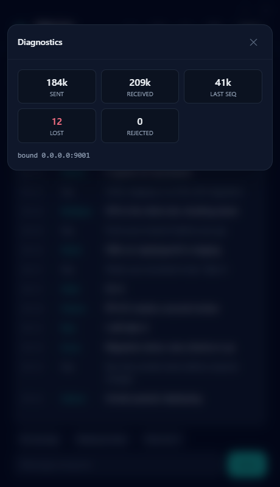

<div align="center">


<h1>Zetta Com</h1>

<p><strong>A LAN intercom.</strong><br>
Hold a key, and the people you choose hear you — one person or the whole room.</p>

<p>
  <a href="https://github.com/joyahmed/zetta-com/actions/workflows/release.yml"></a>
  <a href="LICENSE"></a>
  
  
  
</p>

<p>
  <a href="#why-this-and-not-something-else">Why this</a> ·
  <a href="#install">Install</a> ·
  <a href="#what-it-does">What it does</a> ·
  <a href="#shortcuts">Shortcuts</a> ·
  <a href="#using-it">Using it</a> ·
  <a href="#security">Security</a> ·
  <a href="#how-it-works">How it works</a>
</p>

</div>

No internet. No accounts. No server. No configuration. Start it on two machines
on the same network and they find each other; hold `F8` and talk. Your voice
goes straight from your machine to theirs and touches nothing else on the way.

<p align="center">
  
  
</p>

<p align="center"><em>Idle, and with <code>F8</code> held.</em></p>

---

## Why this and not something else

Every other way of doing this asks for something Zetta Com does not.

| | |
|---|---|
| **Discord, Teams, Slack huddles** | Accounts, an internet connection, and a round trip through somebody else's datacentre to reach the desk next to you. They stop working the moment the line does. |
| **Walkie-talkies** | Hardware to buy, charge, and lose. In some bands, licensing. And nothing on a screen telling you who is actually listening. |
| **A phone call** | One person, and they have to answer. |

Zetta Com is a 2.5 MB installer that needs a network cable and nothing else. It
runs on an air-gapped network. It runs in a workshop, a warehouse, a studio, a
site office — anywhere there is a LAN and people who need to reach each other
faster than walking.

Two things it does that most of the alternatives cannot:

- **It reports absence.** A heartbeat every two seconds means the roster greys
  somebody out within seven of their machine going quiet. Knowing that nobody is
  listening is worth more than knowing that somebody might be.
- **It works while you are working.** The shortcuts are global. You do not
  alt-tab, you do not click into a window, you do not find a tab. You hold a key
  in whatever you were already doing and start talking.

---

## What it does

| | |
|---|---|
| **Push to talk** | Hold `F8` and whoever is selected hears you. Nothing is transmitted unless the key is held. |
| **One person or everyone** | `Ctrl+1…9` talks to a specific PC, `Ctrl+0` to the room. |
| **Messages** | Type, or fire a preset with a key. They arrive as native notifications when the window is hidden. |
| **Finds everyone by itself** | mDNS discovery — no addresses to type on a normal network. |
| **Reports absence** | A heartbeat every two seconds; somebody who goes quiet greys out within seven. It says who is *not* there, not just who is. |
| **Names you choose** | `DEVS002` is not Rafi. Name a machine when you add it, or rename, correct or remove it later. |
| **Says which build everyone is on** | Each machine puts its version on the wire, so the roster names anyone running something different from you. It is for keeping a rollout straight, not for finding faults — a machine too old to talk to you at all cannot tell you its version either. Nothing is asked of the internet; this only knows what the machines on your own network say. |

---

## Install

Grab an installer from [**releases**](../../releases).

### Windows

Run `Zetta Com_x.y.z_x64-setup.exe`. It asks for administrator, because it adds
a firewall rule for you — see [Firewall](#firewall) for what and why.

### macOS

**Apple silicon only.** The Intel build was dropped because GitHub is retiring
the Intel macOS runner and the job stopped being scheduled at all — it sat
queued indefinitely and held every release open behind it. On an Intel Mac,
build it yourself.

> [!IMPORTANT]
> **macOS will say the app is "damaged". It is not.** The builds are unsigned,
> and Gatekeeper refuses a quarantined bundle that carries no signature.
>
> Move the app to `/Applications`, then clear the quarantine flag:
>
> ```bash
> xattr -cr "/Applications/Zetta Com.app"
> ```
>
> You need this again after **every** new download, until the builds are signed.

> [!WARNING]
> **Then turn on local network access**, in
> **System Settings → Privacy & Security → Local Network**.
>
> macOS normally asks for this the first time an app wants it — but clearing
> quarantine can mean the prompt never appears. Without the permission the app
> looks like it is running perfectly while hearing nobody at all, and nothing
> anywhere reports an error.

### Linux

`.deb` or `.rpm`. Needs `libasound2-dev` at build time only.

There is no AppImage. It has to carry its own copy of WebKitGTK and GStreamer to
run on a machine that has neither, which made it 79 MB against the 4 MB of a
`.deb` that simply depends on what the distribution already ships. On anything
else, build it yourself — it is two commands.

### Build it yourself

```bash
bun install
bun run tauri build
```

Artifacts land in `src-tauri/target/release/bundle/` — NSIS on Windows, `.deb`
and `.rpm` on Linux, `.dmg` on macOS. Each platform builds only its own; the
[release workflow](.github/workflows/release.yml) does all of them.

> [!NOTE]
> Building on **Windows** also needs [CMake](https://cmake.org/download/), which
> libopus is compiled with. On **Linux**, `libasound2-dev` for ALSA.

---

## Shortcuts

| Key | |
|---|---|
| `F8` (hold) | talk to whoever is selected |
| `Ctrl+1…9` (hold) | talk to that PC |
| `Ctrl+0` (hold) | talk to everyone |
| `Ctrl+Shift+1…9` | message that PC |
| `Ctrl+Shift+0` | message everyone |
| `F9` | start or stop |
| `Ctrl+Alt+T` | open the window |
| `F1` | show all shortcuts |

<p align="center">
  
</p>

The numbers follow the order PCs appear in the list, so `1…9` are the first
nine. There is no limit on how many PCs you can add — there is a limit on how
many number keys exist. For the rest, select one and hold `F8`.

> [!CAUTION]
> These are **global**. While the app is running it owns `Ctrl+0…9` for every
> program on the machine — browser and editor tabs included. That is the price
> of talking to somebody without leaving what you are doing, and it is why the
> app's own actions sit on function keys instead of taking more of that space.

Every key is listed in the app, **including the ones that failed to register**.
A global shortcut can lose a race to another application, and when it does the
key silently does nothing — which is otherwise indistinguishable from the app
being broken.

---

## Using it

It starts with the machine and lives in the tray. Closing the window hides it,
because an intercom that stops receiving when you tidy your desktop is not an
intercom. **Quit** is in the tray menu.

One socket carries everything: audio, text and heartbeats all travel over
**UDP 9001**, separated by a byte in the header. Discovery is separate, on
**UDP 5353** (mDNS). The port is a setting; everyone on the network must use the
same one.

<p align="center">
  
  
  
</p>

Settings holds the port and every PC. A machine discovery cannot reach is added
by address, and named at the same time. Diagnostics is behind the status line in
the header — the counters moving or not moving is the whole answer to "is this
working".

### Firewall

The Windows installer adds an inbound rule for the executable across **all**
profiles — Domain, Private and Public — so there is no first-start prompt. The
rule is scoped to the *program*, not to port 9001, which means changing the port
in Settings needs no firewall change, and mDNS on 5353 is covered by the same
rule. Uninstalling removes it.

> [!WARNING]
> If you run a build straight out of `target/release/bundle` rather than
> installing it, you get Windows' prompt instead. **Allow it.** If you cancel,
> Windows writes a *block* rule that outranks everything afterwards and leaves
> no visible trace.
>
> This is also why there is no MSI. The firewall rule is added by an NSIS
> installer hook, and the MSI has no equivalent here — so it produced an install
> that looked identical to the working one and then walked the user into exactly
> the failure this application was written to remove.

To repair a cancelled prompt, or add the rule by hand — **as administrator**:

```powershell
netsh advfirewall firewall delete rule name="Zetta Com"
netsh advfirewall firewall add rule name="Zetta Com" dir=in action=allow `
  program="C:\Program Files\Zetta Com\zetta-com.exe" protocol=udp profile=any enable=yes
```

That administrator requirement is also why the installer is per-machine: adding
a firewall rule is not something a per-user install is allowed to do, and one
that tried would fail silently and leave you with the prompt it was meant to
replace.

---

## Where your data lives

One file, on your machine:

```
Windows   %APPDATA%\com.joy.zetta-com\transport.json
macOS     ~/Library/Application Support/com.joy.zetta-com/transport.json
Linux     ~/.config/com.joy.zetta-com/transport.json
```

It holds the port, the PCs you added and the names you gave them, the order they
sit in, your rebound keys, your presets and the room passphrase. There is no
account, no sync, no analytics, and no call to anything outside your own
network. Delete that file and the app is back to a first start.

On Windows, `zetta-com.log` sits beside it. It is the app's own account of which
microphone and speakers it chose, what it bound to, and who it heard from — the
first place to look when somebody cannot be heard. It stays on the machine like
everything else, and it is dropped and started again once it passes a megabyte.

It is kept on the Rust side rather than in the webview because a machine whose
only job is to listen has to come up receiving before any window has loaded.
That is also why the passphrase is in plain text there — see
[Security](#security).

---

## Why it exists

There was an earlier version built from batch files, PowerShell and ffmpeg. It
worked. Nearly every failure in it came from the substrate rather than the
intercom: PowerShell 5.1-only APIs, BOM parsing, CRLF, a script base64-embedded
inside a `.bat`, an installer that swallowed exit codes.

The one that settled it was the firewall. Inbound block rules killed a PC
because the network-facing program was `powershell.exe` — a shared system binary
anything can get muzzled, silently. A dedicated signed executable has its own
firewall identity, its own prompt, its own rule. That is the whole reason this
is an application.

Two things came free: mDNS replaced Windows name resolution, which had broken
two machines outright; and a heartbeat made it possible to report that somebody
is **not** there, which the old version never could.

`docs/PLAN.md` carries the decisions and the reasoning, including what was
rejected and why.

---

## How it works

```
audio    capture, encode, decode, playback. Knows nothing about sockets.
net      socket, header, peers. Knows nothing about codecs.
session  owns both and wires them together.
```

Opus at 20 ms frames, one frame per UDP datagram, unicast to each recipient —
not broadcast, because some WiFi access points rate-limit or drop broadcast
frames and one person silently hears nothing. Each remote talker gets its own
decoder and its own reorder window; a missing frame is concealed rather than
skipped.

Half duplex, deliberately. Local playback is muted while you transmit, so the
echo path never exists and there is nothing to cancel. Full duplex would have
meant acoustic echo cancellation, and that becomes the project rather than a
step in it.

---

## Security

**Set a passphrase.** One machine generates it, everyone else is given it, and
from then on those machines are a room. Every packet is sealed with
ChaCha20-Poly1305, which does two jobs at once:

- **Admission** — a packet that does not authenticate is dropped, so nobody
  outside the room can put audio into your speakers or appear in your roster.
- **Privacy** — the payload is unreadable. Names and presence stop leaking too,
  because heartbeats are sealed the same way.

Every machine shows a short **room code** derived from the key. Compare it
across two screens: same code, same room. Without it, a passphrase typed wrongly
on one machine is indistinguishable from a network fault — everything appears to
run, the roster is empty, and nothing reports an error, because a packet that
fails to authenticate is dropped without a reply.

> [!CAUTION]
> **With no passphrase set, there is no security at all.** Anyone on the network
> can send audio and text to anyone running this, and can capture the packets
> and reconstruct a conversation. They do not need this app to do it, and
> nothing in your roster will ever show they were there.
>
> That is a reasonable trade on a LAN you control. It is not one anywhere else.

What a passphrase does **not** do: anyone who has it hears everything — it is a
channel key, not a per-person one — and anyone with access to a machine can read
it out of the config file.

---

## Licence

MIT. See [LICENSE](LICENSE).
